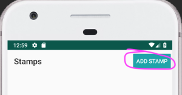
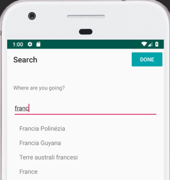
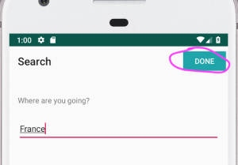
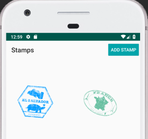

# Android Coding Challenge

The goal of this coding challenge is to make improvements to a small Android app.

## Preparation
Basic Android development tools are needed for the challenge. We recommend preparing up the 
following before receiving the code challenge, in order to prevent issues and be able to dedicate
your time fully to the assignment:

* Android Studio Iguana | 2023.2.1
* Android SDK API 34
* For testing: Android emulator for API 34
* Internet connection (the app makes network requests to the journiapp.com JSON API)
* Optional: A markdown viewer for the README.md instructions (e.g. Android Studio, VS, sublime plugin)

## The Sample App
Warning: Android Studio might suggest to update Android Gradle Plugin, SDK or Kotlin versions. 
In order to save time, it is recommended that you skip the update and ignore the warning.

The main screen shows stamps of various countries the user collected. It may be empty in the 
beginning:

Clicking “Add Stamp” leads to the next screen. In this screen, you can see a search field with 
autocomplete and you can search for places:

You can select a search result and hit "Done" to save their new stamp:

And they will be redirected back to the main screen, you’ll see the stamp for the given country 
appear on the main screen:

## Goals for the coding challenge
Your primary goal for this coding challenge is to complete the 4 following tasks within your time 
limit. Your secondary goal, to be picked up once you finish the primary one, is to do any extra 
further improvements to the app that you feel make sense, including code refactoring.

**We take into consideration the following:**

* Your task solutions
* Prioritization and time management
* Nice UI and good UX
* The readability and maintainability of the code
* Application of SOLID principles
* Use of language features, android APIs, libraries
* Use of design and architectural patterns
* Notes and TODOs for followup work and ideas are appreciated

### 1.) Migrate the StampActivity content to Jetpack Compose with some adjustments
We want to modernize out tech stack, and introduce Jetpack Compose. As we want to make some changes
to our stamp view, we decided to start there. Some additional requirements and notes:
- The UI for the StampActivity should be migrated Jetpack Compose.
- The design doesn't need to be identical; default Compose or Material views should be used.
- Currently this screen always shows 2 columns. We want it to be more responsive, showing more 
columns if there is more space available, such as in bigger devices or in landscape. 
- For image loading android recommends the Coil library, but any solution works.
- The business logic is currently very imperative, and it might need some refactoring to support
Compose. Please keep in mind that this refactor is not the main goal of this task and that further
improvements can be done at the end.
- The activity and the navigation between activities do not need to be changed.

### 2.) Allow user to remove stamps
Users should be able to remove a stamp from their collection by long tapping it. This should be 
implemented by sending a network request to remove the stamp, in order to store the change in our
backend. Because long-tapping can happen accidentally, we should ask the user to confirm if they
really want to delete a stamp.

Implementation note: The “/mobile/stamp” endpoint (API.postStamp()) is used for both adding and
deleting a stamp, by setting the deleted property (true = delete the stamp).

### 3.) Stamps should stay rotated in the same way
Currently stamps are randomly rotated, which adds a nice touch. However, for a given added stamp, 
this rotation seems to be different every time you launch the app, and changes when you scroll, when
you add new stamps or when you remove stamps. We would like to achieve a passport feel, where once 
you get a new stamp with a nice rotation, it stays like that from now on. E.g. if the Germany stamp
is slightly rotated to the right, it should always stay slightly rotated to the right.

### 4.) Avoid making a lot of network request in the search field (SearchActivity)
Currently there is an autocomplete network request made whenever the search field is changed (e.g.
character typed). This is very spammy and really unnecessary while the user is typing text. Please
reduce the number of network requests to a maximum one per 500 milliseconds, and only do them when
necessary.

### Extra) Further improvements
Get extra points by making improvements to the app and the codebase! Some features have been 
implemented in non-standard ways, there are UI/UX issues, there is some code duplication, we could
further migrate to modern UI toolkits, some Kotlin language features have not been used properly, 
there are some failing and empty tests, and there are other potential places for improvement.

## Send us your solution
When your time window is over, please send back the updated codebase (e.g. as a .zip archive).

Good luck, and be sure to send us even a partial solution rather than nothing at all!